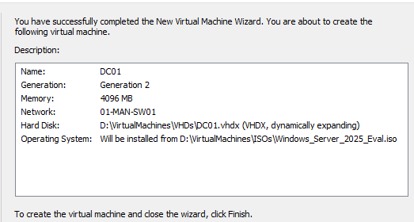

# Riverside Hyper-V Lab Environment

## Purpose

This document outlines the setup of a multi-site virtual lab hosted on Hyper-V. The lab mimics a realistic enterprise network spanning multiple locations. It includes switch configurations, virtual machines, and key Windows Server roles. The environment serves as a sandbox for learning IT support fundamentals and modern enterprise infrastructure.

This environment is part of a personal upskilling initiative and is built to reflect the networking and server topology commonly found in medium to large-scale businesses.

---

## Host System

| Component              | Spec                           |
|------------------------|--------------------------------|
| OS                     | Windows 11 Pro                 |
| CPU                    | Intel Core i5-8350U @ 1.90 GHz |
| RAM                    | 32GB DDR4 @ 2400MHz            |
| Storage                | 500GB External SSD             |
| Virtualization Platform| Hyper-V (Native to Windows)    |

---

## Virtual Networking

### Switch Configuration

- **4 Private Virtual Switches** — simulate isolated site networks (no external connectivity).
- **1 Internal Virtual Switch** — used for internet access via NAT.

| Switch Name | Type     | Purpose             |
|-------------|----------|---------------------|
| MAN-SW01    | Private  | Manchester Office   |
| LEE-SW01    | Private  | Leeds Office        |
| LIV-SW01    | Private  | Liverpool Office    |
| HUL-SW01    | Private  | Hull Office         |
| NATSwitch   | Internal | Internet Access via NAT |

\
*Virtual Swicth Manager - Hyper V*

---

## Virtual Machines

### Domain Controller (DC01)

| Property     | Value                         |
|--------------|-------------------------------|
| Name         | DC01                          |
| OS           | Windows Server 2025 (Eval)    |
| vCPU         | 4                             |
| RAM          | 4GB                           |
| Disk         | 80GB                          |
| Network Cards| 5 (one per site + NATSwitch)  |

#### Services Installed:

- Active Directory Domain Services (AD DS)
- DNS Server
- DHCP Server
- RRAS (Routing and NAT)

> Used as the core controller of the network. Hosts all site connectivity, IP management, DNS resolution, and domain services.

\
*Create new VM - Hyper V*

---

### Optional Client VMs

- Windows 10 Pro Eval
- Named per office: `MAN-LAP-01`, `LEE-PC-01`, etc.
- Domain joined to: `riverside.local`
- Used for:
  - Helpdesk simulation
  - GPO testing
  - Connectivity checks

---

> Look at the complete step by step [build process](04-build-process.md).

## Real World Comparison

*This lab is designed to reflect a multi-site enterprise setup with site-to-site routing and central domain control.*

---

### Hyper V Network Diagram

\
*Current Lab Configuration*

## Learning Outcomes

This environment was created to:

- Build confidence with core Windows Server roles (AD, DNS, DHCP, RRAS)
- Understand virtualized networking and subnetting
- Practice real-world helpdesk scenarios and troubleshooting
- Apply and test Group Policy Objects (GPOs)
- Prepare for integration with cloud services (e.g., Azure Arc)
- Script common setup and rebuild tasks

---

## Enterprise Alignment

While built on a personal device using Hyper-V, the structure of this lab reflects enterprise principles:

- Multi-site VLAN-style segmentation
- Central domain controller managing all subnets
- NAT + internal routing for secure internet access
- Structured DHCP and DNS delegation
- Role-based service deployment

This mirrors many core concepts seen in production networks across SMEs and larger organizations.

---

## Notes

- This environment can be extended with cloud connectors or client monitoring tools.
- Firewall rules, site-to-site VPN, and Azure AD hybrid join are logical future steps.

---

[⬅️ Back to Lab Overview](../README.md) | [Next: Hardware Specification ➡️](02-hardware-specs.md)