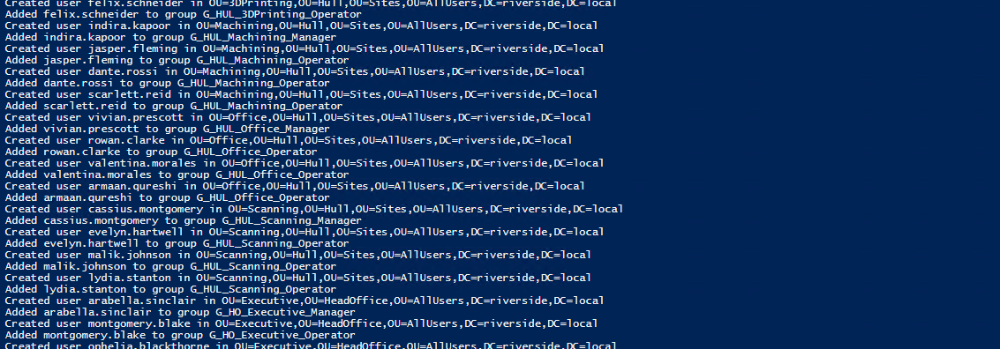

# Riverside Manufacturing - User Creation

 I have used LLM to create a list of 76 sample users to populate this AD structure in order to test the functionality and GPOs and different access levels, this can be found [here](sample_AD_users.csv)

## Overview

This document describes the system, conventions, and structure used for bulk creating Active Directory (AD) users in the Riverside lab environment. The process is automated via a PowerShell script that reads user details from a CSV file and creates user accounts with standardized attributes, OU placements, and group memberships.

---

## Key Components

* **CSV Input**: User data including names, roles, site, department, OU location, and group memberships.
* **PowerShell Script**: Automates user creation and group assignment.
* **Active Directory Structure**: Hierarchical OU and group design based on site, department, and job role.

---

## User Data CSV Format

The CSV file contains the following columns:

| Column Name       | Description                                         |
| ----------------- | --------------------------------------------------- |
| First Name        | User's given name                                   |
| Last Name         | User's surname                                      |
| Username          | User's login name (SAMAccountName)                  |
| Job Role          | User's job title (e.g. Scanning Manager, IT Operator)           |
| Site              | Physical or logical site/location (e.g. Manchester) |
| Department        | Department name (e.g. 3DPrinting, Office)           |
| OU Location       | Distinguished Name (DN) of the target OU in AD      |
| Group Memberships | Semicolon-separated list of groups user belongs to  |

### Example row:

```csv
Marcus,Thompson,marcus.thompson,Manager,Manchester,3DPrinting,"OU=3DPrinting,OU=Manchester,OU=Sites,OU=AllUsers,DC=riverside,DC=local","G_All_Users; G_All_3DPrinting_Users; G_MAN; G_MAN_3DPrinting_Manager"
```

---

## Active Directory Organizational Unit (OU) Structure

Users are created inside specific OUs that follow a hierarchical pattern reflecting their location and department:

```

OU=<Department> (e.g. 3DPrinting, Office, Machining)
  └── OU=<Site> (e.g. Manchester)
       └── OU=Sites
            └── OU=AllUsers
                 └── DC=riverside,DC=local
```

**Example OU path:**

```
OU=3DPrinting,OU=Manchester,OU=Sites,OU=AllUsers,DC=riverside,DC=local
```

---

## User Attributes & Naming Conventions

* **Name:** Combination of first and last name (e.g. "Marcus Thompson")
* **Username (SAMAccountName):** `firstname.lastname` (all lowercase)
* **UserPrincipalName:** `username@riverside.local`
* **Description:** Combination of Department and Job Role (e.g. "3DPrinting Manager")
* **Title:** Combination of Department and Job Role (e.g. "3DPrinting Manager")
* **Department:** Department from CSV (e.g. "3DPrinting")
* **Office:** Site from CSV (e.g. "Manchester")
* **Account Password:** Set to a temporary password entered at script runtime.
* **Account Settings:**

  * Enabled on creation
  * Password change required at next logon

---

## Group Membership Strategy

* The CSV contains a **semicolon-separated list** of group memberships.
* Only the **most specific group** (the last group in the list) is assigned to the user directly.
* Other groups are **nested** (e.g. `G_MAN_3DPrinting_Manager` is nested under `G_MAN` and `G_All_3DPrinting_Users`).
* This minimizes direct group memberships and leverages AD group nesting for efficient permission management.

---

## PowerShell Script Workflow

1. **Load Active Directory module**.
2. **Read user data** from the CSV file.
3. **Prompt for a default password** to assign to all new users.
4. For each user:

   * Extract attributes from CSV.
   * Build `Title` as "`Department` + `JobRole`".
   * Check if the user already exists to avoid duplicates.
   * If not existing, create a new AD user with the given attributes.
   * Add the user to the **most specific group** (last group in Group Memberships list).
5. Log success or errors at each step.

The script can be found [here](build-scripts/03CreateSampleUsers_DC01.ps1)

\
*Create user script*

---

## Sample User Data Extract

| First Name | Last Name | Username        | Job Role | Site       | Department | OU Location                                                                    | Group Memberships                                                              |
| ---------- | --------- | --------------- | -------- | ---------- | ---------- |--------------------------------------------------------------------------------| ------------------------------------------------------------------------------ |
| Marcus     | Thompson  | marcus.thompson | Manager  | Manchester | 3DPrinting | OU=3DPrinting,OU=Manchester,OU=Sites,OU=AllUsers,DC=riverside,DC=local         | G\_All\_Users; G\_All\_3DPrinting\_Users; G\_MAN; G\_MAN\_3DPrinting\_Manager  |
| Priya      | Sharma    | priya.sharma    | Operator | Manchester | 3DPrinting | OU=3DPrinting,OU=Manchester,OU=Sites,OU=AllUsers,DC=riverside,DC=local         | G\_All\_Users; G\_All\_3DPrinting\_Users; G\_MAN; G\_MAN\_3DPrinting\_Operator |
| Rebecca    | Chen      | rebecca.chen    | Manager  | Manchester | Machining  | OU=Machining,OU=Manchester,OU=Sites,OU=AllUsers,DC=riverside,DC=local | G\_All\_Users; G\_All\_Machining\_Users; G\_MAN; G\_MAN\_Machining\_Manager    |

---
\
*Domain users after running script*

---

## Notes & Recommendations

* **Password Policy**: Password is prompted once at script start for consistency.
* **Group Nesting**: Follow and maintain proper AD group nesting for scalable access management.
* **OU Structure**: Maintain consistent OU naming to reflect real-world organizational layout.
* **Error Handling**: Script logs warnings on creation or group assignment failures for troubleshooting.


[⬅️ Back to Global Groups](02-global-groups.md) | [Next: Group Policy ➡️](../02-active-directory/.md)