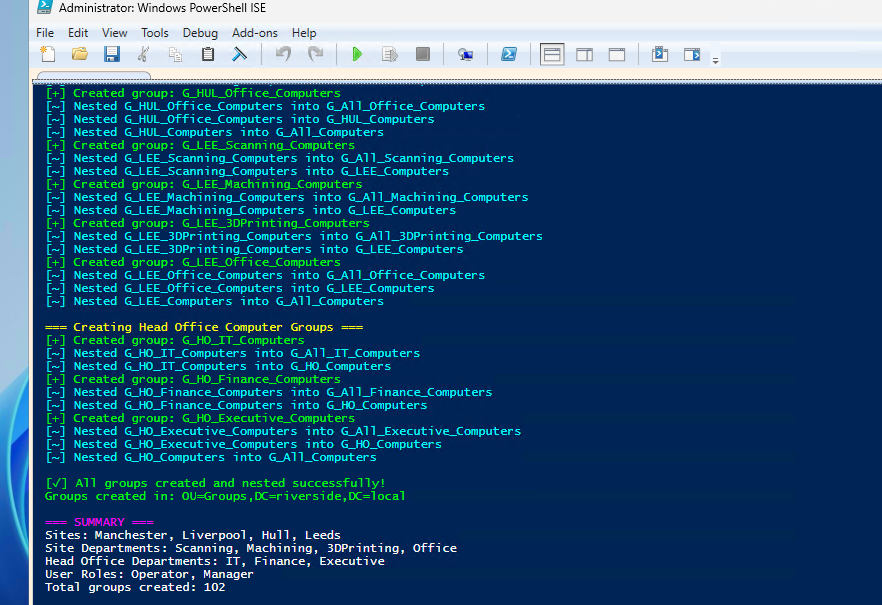

# Active Directory Global Group Structure & Nesting Plan

**Client:** Riverside Manufacturing – Fictional\
**Prepared by:** Warren Bebbington\
**Date:** 14/06/2025

---

## Overview

This plan establishes a **three‑level** Active Directory global group model augmented by a **departmental roll‑up** layer. It provides:

* **Targeted administration** by site and department
* **Shallow nesting** to optimize performance
* **Consistent naming** for automation and auditing

Group creation and nesting adhere to AGDLP principles and accommodate future expansion.

---

## Naming Conventions

| Element             | Notation                                                                      |
| ------------------- | ----------------------------------------------------------------------------- |
| Global group prefix | `G_`                                                                          |
| Domain Local prefix | `DL_`                                                                         |
| Site identifiers    | `MAN`, `LEE`, `LIV`, `HUL`, `HO`                                              |
| Departments         | `Scanning`, `Machining`, `3DPrinting`, `Office`, `IT`, `Finance`, `Executive` |
| Roles               | `Operator`, `Manager`                                                         |
| Computer suffix     | `Computers`                                                                   |

All groups reside under **OU=Groups,DC=riverside,DC=local**.

---

## Group Layers

### 1. Base Groups

Direct membership for user and computer objects:

| Group Name              | Description                                |
| ----------------------- | ------------------------------------------ |
| `G_SITE_DEPT_Operator`  | Operators at specified site and department |
| `G_SITE_DEPT_Manager`   | Managers at specified site and department  |
| `G_SITE_DEPT_Computers` | Computers at specified site and department |

*Example:* `G_MAN_Scanning_Operator` or `G_LEE_Office_Computers`.

### 2. Department Roll‑Ups (side‑scoped)

Aggregates all roles for a department across sites (no nesting into global):

| Group Name               | Description                           |
| ------------------------ | ------------------------------------- |
| `G_All_Scanning_Users`   | All scanning operators & managers     |
| `G_All_Machining_Users`  | All machining operators & managers    |
| `G_All_<Dept>_Computers` | All department computers across sites |

*Note:* Department roll‑ups facilitate department-wide GPOs or resource assignments.

### 3. Site Roll‑Ups

Aggregates all base members at a specific site:

| Group Name           | Description                     |
| -------------------- | ------------------------------- |
| `G_MAN`              | All users at Manchester         |
| `G_LEE`              | All users at Leeds              |
| `G_LIV`              | All users at Liverpool          |
| `G_HUL`              | All users at Hull               |
| `G_HO`               | All users at Head Office        |
| `G_<SITE>_Computers` | All computers at specified site |

Base groups are nested into their corresponding site group.

### 4. Global Groups

Top‑level aggregates:

| Group Name        | Description                           |
| ----------------- | ------------------------------------- |
| `G_All_Users`     | All users across all sites and HO     |
| `G_All_Computers` | All computers across all sites and HO |

Site roll‑up groups are nested into the global groups, ensuring full coverage without duplicate entries from department roll‑ups.

---

## Nesting Diagram

```
Base (G_SITE_DEPT_ROLE)
  ↙          ↘
Dept Roll-Up   Site Roll-Up (G_SITE)
                  ↙
      Global (G_All_Users)
```

*Department roll‑ups are side aggregates and are not nested into global.*

---

## Domain Local Groups (Resource Access)

Resource permissions are assigned to DL_ groups, which include matching global groups:

| DL Group                   | Members                       |
| -------------------------- | ----------------------------- |
| `DL_Scanning_Share_Modify` | `G_All_Scanning_Users`        |
| `DL_Finance_Reports_Read`  | `G_HO`, `G_All_Finance_Users` |

This approach maintains clean ACLs and centralized membership management.

---

## Common Use Cases

| Scenario                                  | Scope                                      |
| ----------------------------------------- | ------------------------------------------ |
| Software deployment (Manchester PCs)      | Filter GPO to `G_MAN_Computers`            |
| File share access (Scanning staff)        | Add `G_All_Scanning_Users` to DL\_Scanning |
| GPO for all Leeds managers                | Filter GPO to `G_LEE`                      |
| Company-wide alert via email distribution | Use `G_All_Users`                          |

---

## Script Overview

A PowerShell script has been developed to:

1. **Ensure-Group**: create each global group under the designated OU
2. **Add-NestedGroup**: Establish correct nesting relationships
3. Handle both **user** and **computer** group structures in a single execution

*(Refer to [`02CreateandNestGroups.ps1`](build-scripts/02CreateandNestGroups.ps1) in this repository for implementation details.)*



---


## Extensibility

Future expansions may include:

* Role aggregates: `G_All_Operators`, `G_All_Managers`
* Additional department scopes or cloud directory synchronization
* Automated audit reports of group membership

This structure provides a robust, scalable foundation for RBAC and GPO targeting across the organisation.
