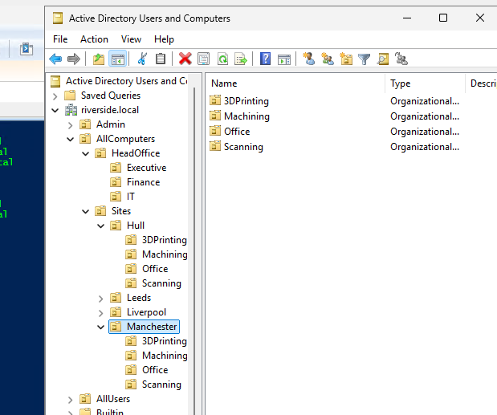

# Active Directory OU Structure & Implementation Plan

**Client:** Riverside Manufacturing - Fictional\
**Prepared by:** Warren Bebbington\
**Date:** 20/04/2025

---

> **Edit**: Renamed Management OU to Office to match group naming convention. All scripts updated.

## Overview

Riverside Manufacturing is a multi-site engineering and production firm providing scanning, machining, and 3D printing services. With operations distributed across four main sites and a centralized Head Office in Manchester, a structured and scalable Active Directory (AD) Organizational Unit (OU) plan is essential for effective user, computer, group, and policy management.

This document outlines a full AD structure that:

- Mirrors organizational layout (locations, departments, roles)
- Supports targeting and filtering for users and devices
- Enables efficient administrative delegation
- Allows dynamic attribute-based filtering (e.g., by job title or department)
- Excessive OU depth for this setup to represent real world applications

---

## Organizational Summary

### **Sites:**

- Manchester (Head Office)
- Liverpool
- Hull
- Leeds

### **Departments per site:**

- Scanning
- Machining
- 3D Printing

### **Management Roles:**

- Site Manager per site
- Department Managers (Scanning, Machining & 3D Printing)
- Finance Manager (Head Office)
- IT Manager (Head Office)
- CEO (Head Office)

---

### **Company Management Structure**


## Top-Level AD Structure

```
DC=riverside,DC=local
|
|-- OU=Sites
|    |-- OU=Manchester
|    |    |-- OU=Scanning
|    |    |    |-- OU=Users
|    |    |    |-- OU=Computers
|    |    |-- OU=Machining
|    |    |    |-- OU=Users
|    |    |    |-- OU=Computers
|    |    |-- OU=3DPrinting
|    |    |    |-- OU=Users
|    |    |    |-- OU=Computers
|    |    |-- OU=Office
|    |         |-- OU=Users
|    |         |-- OU=Computers
|    |-- OU=Leeds
|    |    |-- OU=Scanning
|    |    |    |-- OU=Users
|    |    |    |-- OU=Computers
|    |    |-- OU=Machining
|    |    |    |-- OU=Users
|    |    |    |-- OU=Computers
|    |    |-- OU=3DPrinting
|    |    |    |-- OU=Users
|    |    |    |-- OU=Computers
|    |    |-- OU=Office
|    |         |-- OU=Users
|    |         |-- OU=Computers
|    |-- OU=Liverpool
|    |    |-- OU=Scanning
|    |    |    |-- OU=Users
|    |    |    |-- OU=Computers
|    |    |-- OU=Machining
|    |    |    |-- OU=Users
|    |    |    |-- OU=Computers
|    |    |-- OU=3DPrinting
|    |    |    |-- OU=Users
|    |    |    |-- OU=Computers
|    |    |-- OU=Office
|    |         |-- OU=Users
|    |         |-- OU=Computers
|    |-- OU=Hull
|    |    |-- OU=Scanning
|    |    |    |-- OU=Users
|    |    |    |-- OU=Computers
|    |    |-- OU=Machining
|    |    |    |-- OU=Users
|    |    |    |-- OU=Computers
|    |    |-- OU=3DPrinting
|    |    |    |-- OU=Users
|    |    |    |-- OU=Computers
|    |    |-- OU=Office
|    |         |-- OU=Users
|    |         |-- OU=Computers
|-- OU=HeadOffice
|    |-- OU=IT
|    |    |-- OU=Users
|    |    |-- OU=Computers
|    |-- OU=Finance
|    |    |-- OU=Users
|    |    |-- OU=Computers
|    |-- OU=Executive
|         |-- OU=Users
|         |-- OU=Computers
|
|-- OU=Groups
|-- OU=ServiceAccounts
|-- OU=Admin
```

---

> This OU structure can be created using the [Create OU](build-scripts/01CreateOUStructure_DC01.ps1) script.\


\
*Screenshot of 05CreateOUStructure_DC01.ps1 output*

\
*Active Directory OU Structure after running PowerShell script*

---

##  Targeting Use Cases

| Use Case                                      | Method                                                 |
|-----------------------------------------------|--------------------------------------------------------|
| Apply policy to all Machining Operators       | OU-based targeting or Title="Machining Operator"       |
| Apply software to all users at Sheffield      | Use `Office=Sheffield` or OU=Sheffield                 |
| Notify all Site Managers                      | Group membership Site Managers or `Title=Site Manager` |
| Filter all 3D Printing users across all sites | Department="3D Printing" or OU filter                  |

---

##  Delegation & Security

- Site Managers will have delegated control over their respective site OU (excluding Management)
- IT Manager (HO) has domain-wide delegated control over IT OU and all computers
- Finance Manager has access to Finance OU only
- CEO has read access to all user OUs and will employ IT department for structure changes

---

##  Notes

- OU design intentionally separates Users and Computers to allow targeted GPO
- Future additions like External Users, Apprenticeships, or QA dept can be added easily
- Azure AD Connect can map `Title`, `Office`, and `Department` to cloud attributes for hybrid use

[⬅️ Back to Lab Overview](../README.md) | [Next: Global Group Design ➡️](../02-active-directory/global-groups.md)