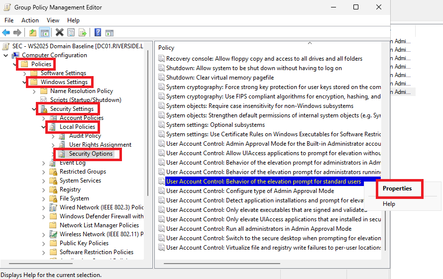
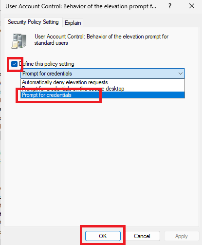

# Riverside Manufacturing - Security Baseline GPOs

This document describes the security baseline policies applied to the Riverside lab Active Directory environment. The goal is to simulate a secure, realistic enterprise setup by implementing Microsoft’s security recommendations via Group Policy Objects (GPOs) and adjusting for lab usability where needed.

---

## Overview

The following Group Policy Objects have been applied:

| Scope                  | GPOs Applied |
|------------------------|--------------|
| Domain Root            | Default Domain Policy, Windows Server 2025 – Domain Security |
| Domain Controllers OU  | Default Domain Controllers Policy, Windows Server 2025 – Domain Controller |
| AllComputers OU        | Windows 10 22H2 – Computer Security, BitLocker, Defender Antivirus |

These GPOs are sourced from Microsoft's [Security Compliance Toolkit](https://learn.microsoft.com/en-us/windows/security/threat-protection/security-compliance-toolkit-10) and are applied without modification unless noted.

---

## Domain-Level Security Policies

### 🟢 Default Domain Policy
- Password length and complexity - increased to 12
- Account lockout thresholds
- Kerberos ticket lifetime configuration

### 🔐 Windows Server 2025 - Domain Security Baseline
- NTLM restrictions and SMB signing
- Enforced secure channel and LSA protections
- Baseline audit policy
- Stronger authentication mechanisms (LDAP signing, etc.)

---

## Domain Controllers OU Policies

### 🛠️ Default Domain Controllers Policy
- Assign logon rights to specific groups
- Audit policy settings for account logon and object access
- Restrict access to admin shares and services

### 🧱 Windows Server 2025 - Domain Controller Baseline
- Disable legacy protocols and interfaces (WinRM, Print Spooler, SMBv1)
- Enforce strict Kerberos and NTLM behavior
- Configure Protected Users, registry hardening, and admin account protections

---

## Endpoint Security – AllComputers OU

### 🖥️ Windows 10 22H2 – Computer Security Baseline
- Enforce UAC and secure desktop elevation
- Disable autorun and block unsigned driver installation
- Configure Windows Update and telemetry
- Restrict access to legacy protocols and interfaces

### 💽 BitLocker GPO
- XTS-AES 256-bit encryption on OS drives
- TPM required + PIN at startup
- Auto-backup recovery keys to AD
- Drive encryption is enforced during provisioning

### 🛡️ Microsoft Defender Antivirus
- Real-time protection, cloud-based scanning
- PUA protection enabled
- Weekly full scans configured
- Controlled Folder Access (CFA) turned on

---

## Usability Adjustments (Lab-Specific)

### Password Minimum Length - Edited in Default Domain Policy

Increased minimum password legnth from 7 to 12 - using Computer Configuration > Policies > Windows Settings > Security Settings > Account Policies > Password Policy > Minimum Password Length

### UAC Prompt Behavior - Edited in Windows 10 Computer Security GPO

To allow administrative commands from a standard user session, the following setting has been applied:

**Policy:**  
> *User Account Control: Behavior of the elevation prompt for standard users*

**Value:**  
> *Prompt for credentials on the secure desktop*

This enables `Run as administrator` to trigger a secure password prompt when a normal user launches PowerShell, CMD, or apps that require elevation. Useful for testing elevated permissions and privilege boundaries.

---

## Notes & Recommendations

- All baseline GPOs are applied as separate, unmodified imports to preserve default Microsoft settings.
- GPOs are linked directly to their respective scopes (Domain Root, Domain Controllers OU, AllComputers OU).
- `gpresult /h gpo-report.html` is used to verify inheritance and application per machine.
- Drive mapping, login scripts, and user-facing UI GPOs will be documented separately under gpo-inventory.md.

---

[⬅️ Back to Lab Overview](../README.md) | [Next: GPO Inventory ➡️](02-gpo-inventory/README.md)
