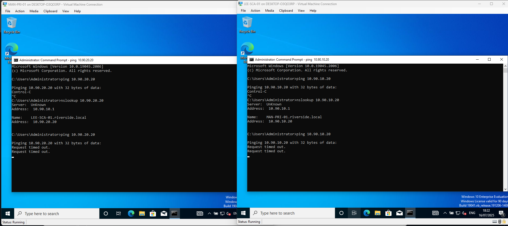
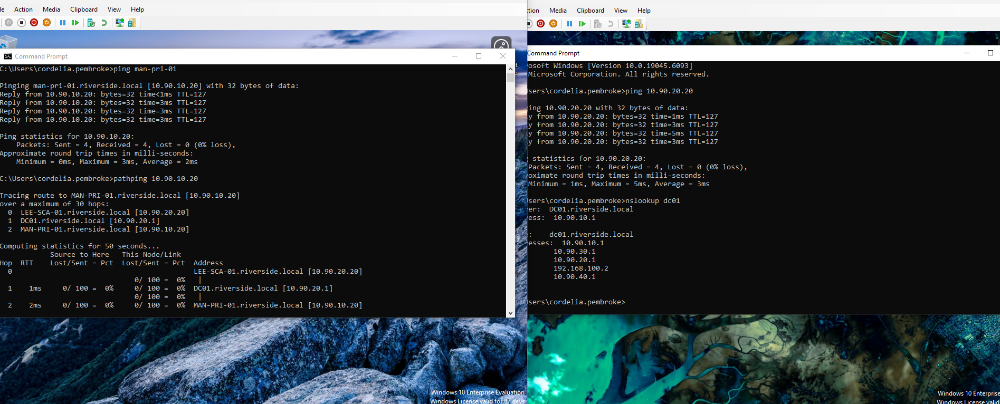

# Sec_All Internal Ping

---

This GPO is applied at the AllComputers OU level and will allow client machines to respond to ICMPv4 Echo Request from an IP in 
either the 10.90.0.0/16 or 192.168.100.0/24 ranges in domain and private profile only.

---

The policy will enforce the following rule in Computer Configuration > Policies > Windows Settings > Security Setting > Windows Defender Firewall with Advanced Security > Inbound Rules

**Allow Internal ICMPv4 Request Echo - Ping**

| Name                                         |Description                              |
|----------------------------------------------|------------------------------------------|
| Enabled                                      |	True
| Program                                      |	Any
| Action                                       |	Allow
| Security                                     |	Require authentication
| Authorized                                   | computers	
| Authorized                                   | users	
| Protocol                                     |	1
| Local port                                   |	Any
| Remote port                                  |	Any
| Local scope                                  |	Any
| Remote scope                                 |	10.90.0.0/255.255.0.0, 192.168.100.0/255.255.255.0
| Profile                                      |	Domain, Private
| Network interface type                       |	All
| Service                                      |	All programs and services
| Allow edge traversal                         |	False

---

### Before applying GPO

---

### After applying GPO

*Now clients can ping one another which is desirable in this lab.*