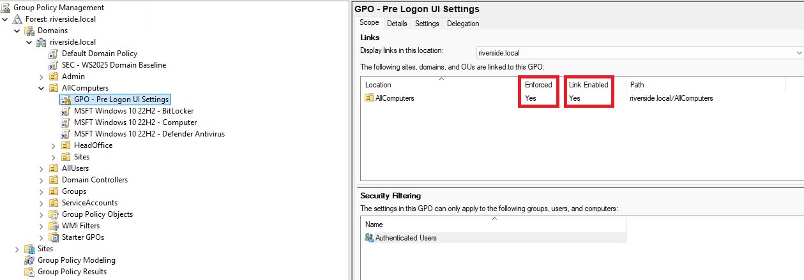
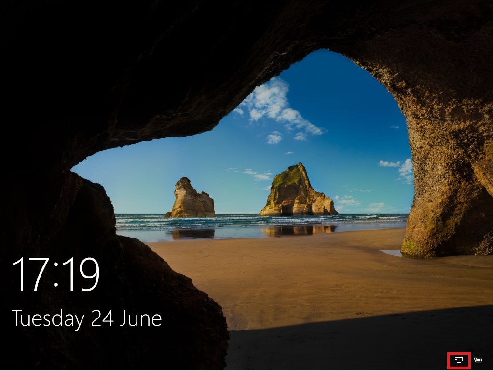
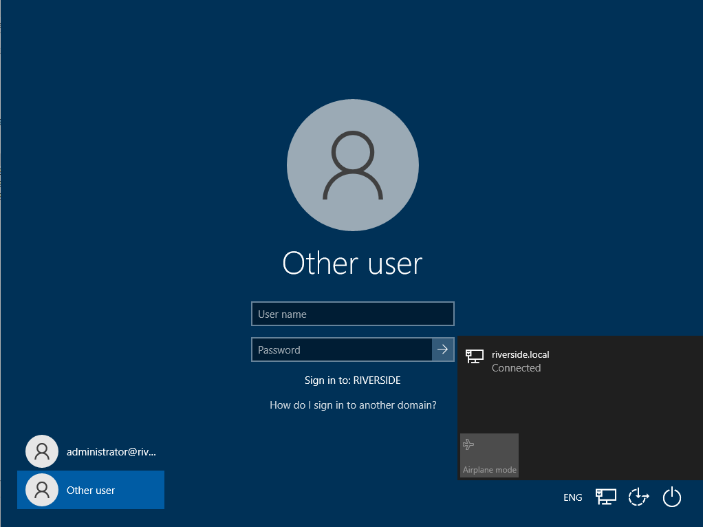
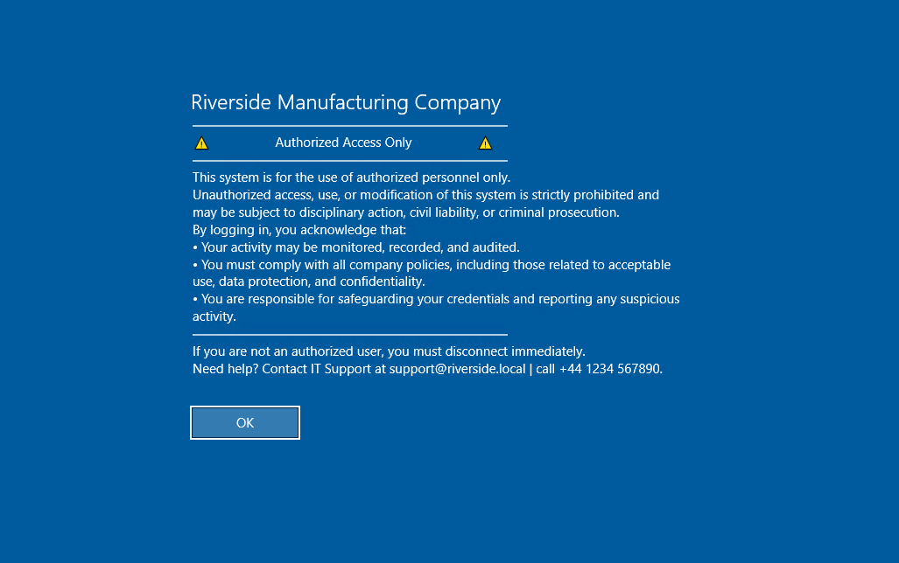
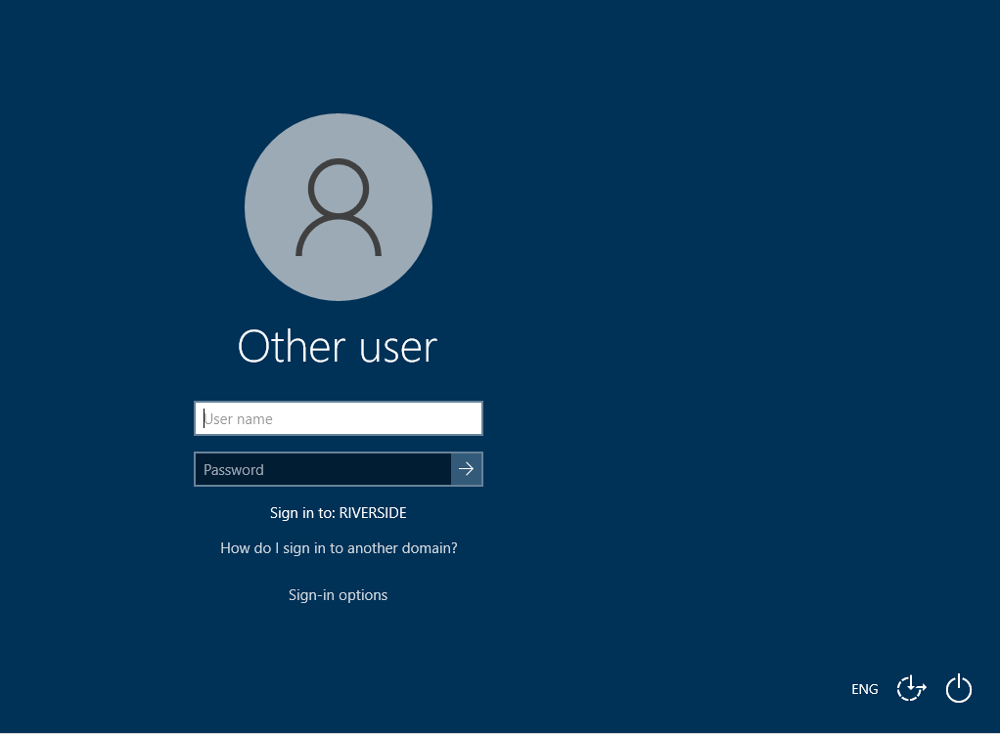

# GPO- Pre-logon UI Settings

---

The first GPO created will be linked and enforced at the All Computer OU level and will be used to standardise all PCs pre login.

---

The policy will enforce the following in Computer Configuration > Policies > Administrative Templates > System > Logon:

- Turn off picture password sign-in                               - Enabled
- Block user from showing account details on login                - Enabled
- Show clear logon background                                     - Enabled
- Turn off app notifications on lock screen                       - Enabled
- Do not display network selection UI                             - Enabled
- Do not enumerate connected users on domain-joined computers     - Enabled
- Hide entry points for Fast User Switching                       - Enabled
- Do not display the Getting Started welcome screen at logon      - Enabled
- Always use custom logon background                              - Enabled
- Removal of the default Windows hero image at login.             - Enabled
- Blocking the display of the previously logged-in user.          - Enabled
- Disabling the ability to change network connection pre-login.   - Enabled
- Applying a customer Welcome title and usage policy.             - Enabled
- Applying a standardised solid colour background.                - Enabled

The policy will enforce the following in Computer Configuration > Policies > Windows Settings > Security Settings > Local Policies > Security Options:

- Interactive logon: Don't show the last signed-in                - Enabled
- Interactive logon: Don't display username at sign-in            - Enabled
- Interactive logon: Message text for users attempting to log on  - Enabled - Custom message
- Interactive logon: Message title for users trying to log on     - Enabled - Custom title

By editing these two sections we can standardise the look and security of machines pre logon.

---

### Before applying GPO

---

### After applying GPO

\
*Here we can see the hero image has been replaced with a plain system colour*

\
*And here we can see the removal of last logged-in user and the ability to change network pre-logon*

This is a much cleaner look and a very simple policy to apply.