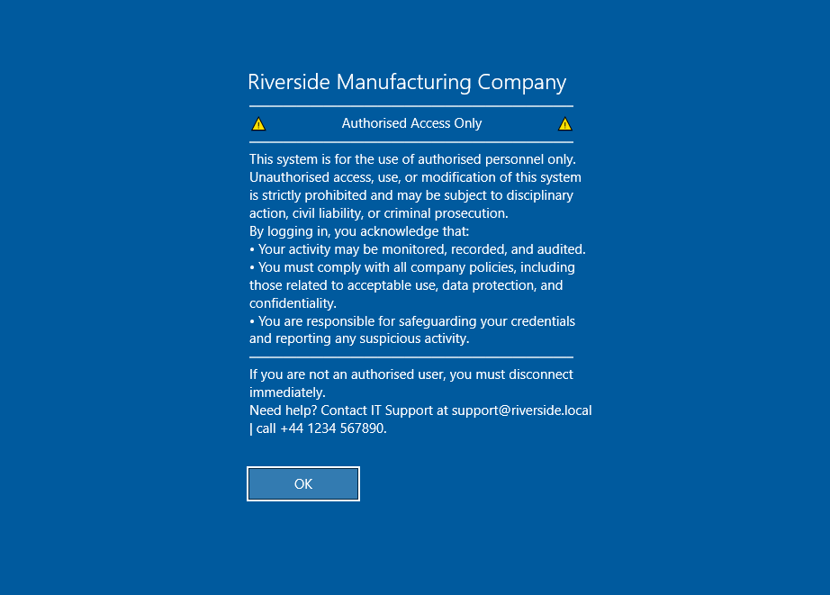

# GPO- Pre-logon UI Settings

---

The first GPO created will be linked at the All Computer OU level and will be used to standardise all PCs pre login.

---

The policy will enforce the following in Computer Configuration > Policies > Administrative Templates > System > Logon:

- Always use custom logon background	                        - Enabled	
- Block user from showing account details on sign-in	        - Enabled	
- Do not display network selection UI	                        - Enabled	
- Do not display the Getting Started welcome screen at logon	- Enabled	
- Do not enumerate connected users on domain-joined computers	- Enabled	
- Enumerate local users on domain-joined computers	            - Disabled	
- Hide entry points for Fast User Switching	                    - Enabled	
- Show clear logon background	                                - Enabled	
- Show first sign-in animation	                                - Disabled	
- Turn off app notifications on the lock screen	                - Enabled	
- Turn off picture password sign-in	                            - Enabled	
- Turn off Windows Startup sound	                            - Enabled

The policy will enforce the following in Computer Configuration > Policies > Administrative Templates > Control Panel > Personalization

- Force a specific default lock screen and logon image	        - Enabled	
    - Path to lock screen image:	                            - C:\Logon\bg.jpg
    - Turn off fun facts, tips, tricks, and more on lock screen	- Enabled
- Prevent changing lock screen and logon image	                - Enabled	
- Prevent enabling lock screen camera	                        - Enabled	
- Prevent enabling lock screen slide show	                    - Enabled

The policy will enforce the following in Computer Configuration > Policies > Windows Settings > Security Settings > Local Policies > Security Options:

- Interactive logon: Do not require CTRL+ALT+DEL	                                                 - Disabled
- Interactive logon: Don't show the last signed-in                                                   - Enabled
- Interactive logon: Message text for users attempting to log on                                     - Custom
- Interactive logon: Message title for users attempting to log on                                    - "Riverside Manufacturing Company"
- Interactive logon: Number of previous logons to cache (in case domain controller is not available) - 5 logons
- Interactive logon: Prompt user to change password before expiration                                - 7 days
- Interactive logon: Require Domain Controller authentication to unlock workstation                  - Disabled
- Interactive logon: Display user information when the session is locked	                         - User display name only
- Interactive logon: Don't display username at sign-in	                                             - Enabled
- Interactive logon: Machine account lockout threshold	                                             - 10 invalid logon attempts
- Interactive logon: Machine inactivity limit	                                                     - 300 seconds

By editing these two sections we can standardise the look and security of machines pre logon.

---

### Before applying GPO

---

### After applying GPO

\
*Here we can see the hero image has been replaced with a plain system colour and our pre-logon message and title*

\
*And here we can see the removal of last logged-in user and the ability to change network pre-logon*

This is a much cleaner look and a very simple policy to apply.