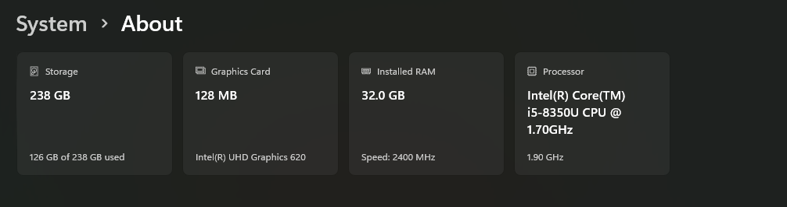

##  `documentation/hardware-specs.md`

###  Purpose  
This document outlines the physical hardware and virtual infrastructure used to run the simulated Riverside multi-site lab. It provides insight into system limitations, performance considerations, and how resources were allocated to achieve a functional Active Directory lab environment on a single host machine.

---

###  Host Machine Specifications

| Component         | Specification                                            |
|------------------|----------------------------------------------------------|
| Host Device       | Dell Latitude 7940 - Battery Dead                        |
| CPU               | Intel(R) Core(TM) i5-8350U CPU @ 1.70GHz   1.90 GHz      |
| RAM               | 32 GB DDR4 @ 2400MHz                                     |
| Storage           | 500GB External SSD                                       |
| OS                | Windows 11 Pro                                           |
| Virtualization    | Hyper-V enabled                                          |
| Network Interfaces| Intel(R) Dual Band Wireless-AC 8265 + Multiple vSwitches |

\
*Host Machine Spec*

---

###  Virtual Infrastructure Overview

| VM Name    | Role                   | RAM (GB) | vCPU | Disk (GB) | Notes                                  |
|------------|------------------------|----------|------|-----------|----------------------------------------|
| DC01       | Primary Domain Controller, DHCP, DNS, RRAS | 4        | 4    | 80        | Multi-role core server                 |
| MAN-LAP-01 | Win10 Client (Manchester) | 4        | 4    | 80        | Testing user login/GPOs                |
| LEE-PC-01  | Win10 Client (Leeds)     | 2        | 4    | 80        | Selectively ran for specific scenarios |
| LIV-PC-01  | Win10 Client (Liverpool) | 2        | 4    | 80        | Selectively ran for specific scenarios                                       |
| HUL-LAP-01 | Win10 Client (Hull)      | 4        | 4    | 80        | Selectively ran for specific scenarios                                       |

_Total RAM used: ~16GB  when 4 client and DC Run simultaneously.
Remaining for host and management: ~16GB (depending on host RAM).
Dynamic disk size in Hyper V prevents full disk space being taken unless required._

---

###  Virtual Switch Configuration

| vSwitch Name | Type     | Connected To | Purpose                             |
|--------------|----------|--------------|-------------------------------------|
| NATSwitch    | Internal | Host - NAT`d | Provides internet to lab (via DC01) |
| MAN-SW01     | Private  | n/a          | Manchester Site LAN                 |
| LEE-SW01     | Private  | n/a          | Leeds Site LAN                      |
| LIV-SW01     | Private  | n/a          | Liverpool Site LAN                  |
| HUL-SW01     | Private  | n/a          | Hull Site LAN                       |

\
*Virtual Switch Manager - Hyper V*

---

###  Performance Considerations

- Three VMs run simultaneously for GPO and routing testing
- Host CPU rarely hits 100% due to low number of VM`s running
- Disk IO spikes occasionally — SSD highly recommended
- Dynamic memory turned off for stability during routing and DHCP testing

---

###  Lessons Learned

- 32GB RAM is the sweet spot for running multiple VMs with GUI clients, 16GB would not perform well.
- Keeping client VMs lightweight (4GB RAM) helps performance
- Hyper-V internal switches make subnet isolation easier to replicate than expected
- Adding NAT via RRAS on DC01 saved time over configuring firewall rules

---
