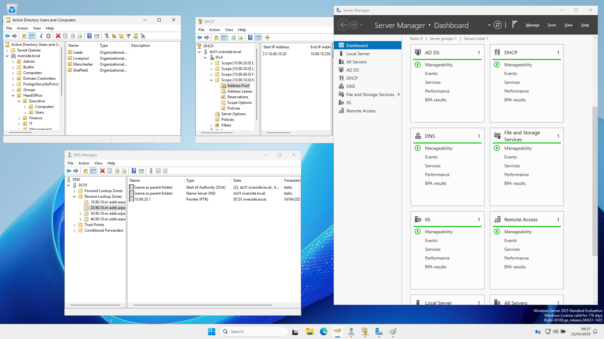

# Riverside Lab 🖥️🌐

This repository documents my self-built Hyper-V home lab environment — a multi-site Active Directory setup designed to simulate real-world IT infrastructure. 

The purpose of this lab is to deepen my understanding of Windows Server administration, networking fundamentals, Active Directory, DHCP/DNS configuration, GPOs, and IT helpdesk-related tasks. I'm currently working in a helpdesk role, and I'm using this time to reinforce my hands-on knowledge with solid examples and a documented setup.

Everything here has been built from scratch on personal hardware, and is meant to serve as both a learning aid and a reference I can expand on over time.



---

## 🧰 What’s in the Lab?

This setup includes:

- A **Windows Server 2025 Domain Controller** running:
  - Active Directory Domain Services
  - DHCP & DNS roles
  - Routing & Remote Access for multi-subnet connectivity
- Four virtual private networks simulating separate office sites:
  - Manchester, Leeds, Liverpool, and Hull
- Internal NAT network for limited internet access
- A structured domain with:
  - OU hierarchy
  - Security groups
  - Test users and PowerShell automation
- DHCP scopes, DNS zones, routing, and GPOs
- Optional client machines for simulating common helpdesk scenarios

---

## 📁 Repository Structure

```plaintext
riverside-lab/
├── README.md                                       # This file
├── infrastucture/                                  # Hyper-V setup documentation
│   ├── build-scripts/                              # PowerShell scripts used in building the system
|   |   ├── 01ImportHyperVandCreateNATSwitchandConfigHostNIC_Host.ps1  
|   |   ├── 02CreateDCVM_Host.ps1
|   |   ├── 03DCNICConfig_DC01.ps1
|   |   ├── 04aRenameandAddRoles_DC01.ps1
|   |   ├── 04bADDSSetup_DC01.ps1
|   |   ├── 05CreateDHCPScopes_DC01.ps1
|   |   ├── 06CreateDNSZones_DC01.ps1
|   |   └── 07RRASSetup_DC01.ps1                    
│   ├── images/                                     
│   ├── build-process.md                            # Step-by-step lab build guide
│   ├── environment-setup.md                        # Full description of lab setup
|   ├── hardware-specs.md                           # Lab host machine details
│   ├── ip-addressing-scheme.md                     # IP/subnet breakdown
|   ├── Riverside Physical Topology.drawio.png      # Physical Diagram of what I intend the Lab to simulate
│   └── Riverside Virtual Topology.drawio.png       # Visual Description of the Hyper V Setup used
├── active-directory/                               # AD setup and scripts
│   ├── build-scripts/
|   │   ├── 01CreateOUStructure_DC01.ps1
│   ├── images/
│   ├── ou-structure.md                             # Full description of OU design
│   ├── security-groups.md                          # TO DO
│   └── sample-users.md                             # LLM generated user list
├── group-policy/                                   # GPO setup and screenshots
│   ├── images/                            
│   ├── gpo-inventory.md                            # TO DO
│   └── security-baseline.md                        # TO DO
├── file-server/                                    # Shared folder setup
│   ├── images/
│   ├── folder-structure.md                         # TO DO
│   └── permissions-matrix.md                       # TO DO
├── helpdesk-scenarios/                             # Realistic learning scenarios
│   ├── password-reset.md                           # TO DO
│   ├── account-unlock.md                           # TO DO
│   ├── modified-access.md                          # TO DO
│   └── group-management.md                         # TO DO
└── projects/                                       # Mini-projects
    ├── automated-onboarding/                       # TO DO
    ├── security-audit/                             # TO DO
    └── monitoring-setup/                           # TO DO
```

## 🔍 Why This Lab?

This project is more than just a test bed — it’s where I can safely explore real-world scenarios and reinforce what I’ve learned. I’m focusing on:

Hands-on IT support skills (like account lockouts, group changes, folder permissions, etc.)

Understanding domain environments

Practicing automation with PowerShell

Improving troubleshooting and documentation skills

The goal is to become more capable, resourceful, and confident in the areas I already work in — and to grow beyond that.

## ⚙️ Current Setup
You can view the current network layout, addressing scheme, and server configurations in the [environment-setup.md](infrastucture/environment-setup.md) and related files.

💡 I’ll keep this repository updated as I expand the lab and experiment with new configurations.

## 🚧 Work in Progress
This lab is evolving as I learn. Some features (like monitoring, file server structure, and onboarding automation) are in early stages and will be fleshed out over time.