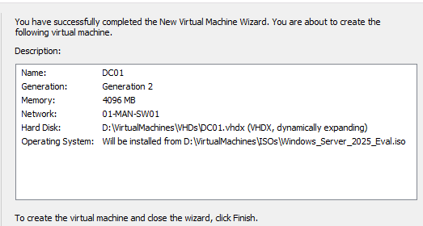

# Riverside Hyper-V Lab Environment

## Purpose

This document outlines the setup of a multi-site virtual lab hosted on Hyper-V. The lab mimics a realistic enterprise network spanning multiple locations. It includes switch configurations, virtual machines, and key Windows Server roles. The environment serves as a sandbox for learning IT support fundamentals and modern enterprise infrastructure.

This environment is part of a personal upskilling initiative and is built to reflect the networking and server topology commonly found in medium to large-scale businesses.

---

## Host System

| Component              | Spec                           |
|------------------------|--------------------------------|
| OS                     | Windows 11 Pro                 |
| CPU                    | Intel Core i5-8350U @ 1.90 GHz |
| RAM                    | 32GB DDR4 @ 2400MHz            |
| Storage                | 500GB External SSD             |
| Virtualization Platform| Hyper-V (Native to Windows)    |

---

## Virtual Networking

### Switch Configuration

- **4 Private Virtual Switches** — simulate isolated site networks (no external connectivity).
- **1 Internal Virtual Switch** — used for internet access via NAT.

| Switch Name | Type     | Purpose             |
|-------------|----------|---------------------|
| MAN-SW01    | Private  | Manchester Office   |
| LEE-SW01    | Private  | Leeds Office        |
| LIV-SW01    | Private  | Liverpool Office    |
| HUL-SW01    | Private  | Hull Office         |
| NATSwitch   | Internal | Internet Access via NAT |

\
*Virtual Swicth Manager - Hyper V*

---

## Virtual Machines

### Domain Controller (DC01)

| Property     | Value                         |
|--------------|-------------------------------|
| Name         | DC01                          |
| OS           | Windows Server 2025 (Eval)    |
| vCPU         | 4                             |
| RAM          | 4GB                           |
| Disk         | 80GB                          |
| Network Cards| 5 (one per site + NATSwitch)  |

#### Services Installed:

- Active Directory Domain Services (AD DS)
- DNS Server
- DHCP Server
- RRAS (Routing and NAT)

> Used as the core controller of the network. Hosts all site connectivity, IP management, DNS resolution, and domain services.

\
*Create new VM - Hyper V*

---

### Optional Client VMs

- Windows 10 Pro Eval
- Named per office: `MAN-LAP-01`, `LEE-PC-01`, etc.
- Domain joined to: `riverside.local`
- Used for:
  - Helpdesk simulation
  - GPO testing
  - Connectivity checks

---

## Real World Comparison

*This lab is designed to reflect a multi-site enterprise setup with site-to-site routing and central domain control.*

---

## Build Process (Step-by-Step)

### Step 1a: Create Virtual Switches

Open Hyper-V Manager > Virtual Switch Manager

- Create four Private switches: `MAN-SW01`, `LEE-SW01`, `LIV-SW01`, `HUL-SW01`
- > Step 1a should be done manually

### Step 1b:

- Create one Internal switch: `NATSwitch` and configure static IP of `192.168.100.1/24` on Host 
- > Automate Step 1b: [Create NAT and Config](../env-build-scripts/01ImportHyperVandCreateNATSwitchandConfigHostNIC_Host.ps1) script.

---

### Step 2a: Create Domain Controller (DC01)

- Name: `DC01`
- Generation: 2
- RAM: 4GB
- Disk: 80GB
- OS: Windows Server 2025 (Evaluation ISO)

In VM Settings:
- Add NATSwitch 
- > Automate Step 2a: [Create DC VM](../env-build-scripts/02CreateDCVM_Host.ps1) script.

#### Step 2b:

Manually Add network cards to the private switches to the VM using Hyper V settings - `MAN-SW01`, `LEE-SW01`, `LIV-SW01`, `HUL-SW01`

- Right Click DC01 in Hyper V Manager > Settings
- Add Hardware > Network Adapter > Click Add
- Select each of the private switches from the virtual switch dropdown and click apply
- Add all switches and Click OK

Start DC01 and install the OS.

> Step 2b needs completing manually on the host machine.
---

### Step 3: Configure Networking

On DC01:

- Rename NICs in **Control Panel > Network and Sharing Center > Change Adapter Settings**
- Use `Get-VMNetworkAdapter -VMName "DC01"` (on host) to match NICs to V-switches via the MAC addresses.

\
*Screenshot of powershell output on host machine, showing all NIC`s on DC01.*

\
*This can be matched on te NIC details on DC01 by double-clicking a NIC, then clicking Details and looking for the MAC address.*

#### IP Configuration (Static):

| NIC Role       | IP Address     | Subnet         | Gateway         | DNS              |
|----------------|----------------|----------------|------------------|------------------|
| MAN            | 10.90.10.1     | 255.255.255.0  | (leave blank)   | 10.90.10.1       |
| LEE            | 10.90.20.1     | 255.255.255.0  | (leave blank)   | 10.90.10.1       |
| LIV            | 10.90.30.1     | 255.255.255.0  | (leave blank)   | 10.90.10.1       |
| HUL            | 10.90.40.1     | 255.255.255.0  | (leave blank)   | 10.90.10.1       |
| NATSwitch      | 192.168.100.2  | 255.255.255.0  | 192.168.100.1   | 8.8.8.8 / 8.8.4.4|

> Automate Step 3: [Configure DC01 Network Cards](../env-build-scripts/03DCNICConfig_DC01.ps1) script.

---

### Step 4a: Add Roles and Promote to Domain Controller

- Change PC name to `DC01` and restart.
- Open **Server Manager > Add Roles and Features**.
- Add:
  - Active Directory Domain Services
  - DHCP Server
  - DNS Server
  - Remote Access
- Install required management tools.

> Automate Step 4a: [Change PC name and Add roles](../env-build-scripts/04RenameandAddRoles.ps1) script.

#### Domain Setup - 4b:

- Create **new forest**: `riverside.local`
- Set a secure **Directory Services Restore Mode (DSRM)** password (not shown).
- Use default NetBIOS name.
- Restart when prompted.

> Automate Step 4b: [Domain Setup](../env-build-scripts/04bADDSSetup.ps1) script.

---

### Step 5: Configure DHCP

In Server Manager:

- Complete DHCP post-install configuration.
- Tools > DHCP > [ServerName] > IPv4 > New Scope

Repeat for each site:

| Setting            | Value                  |
|--------------------|------------------------|
| Start IP           | 10.90.x.20             |
| End IP             | 10.90.x.250            |
| Subnet Mask        | 255.255.255.0          |
| Lease Duration     | 1 Day                  |
| Gateway            | 10.90.x.1              |
| DNS Server         | 10.90.10.1             |

> Ensure all scopes are active and assigned to the correct interfaces.

---

### Step 6: Configure DNS

- Confirm A records are being created.
- Add Forwarders: `8.8.8.8`, `1.1.1.1`
- Right-click Reverse Lookup Zones > New Zone (per subnet)

Set each to:
- Zone Type: Primary
- Scope: To all servers in the domain
- Zone Name: Based on subnet (e.g. `10.90.10`)
- Dynamic Updates: Secure only

For each DHCP scope:
- Enable dynamic DNS updates
- Enable updates for clients not requesting DNS

---

### Step 7: Setup RRAS (Routing & NAT)

- Tools > Routing and Remote Access
- Right-click `DC01` > Configure and Enable Routing and Remote Access
- Select **Custom Configuration** > NAT and LAN Routing
- Start Service

#### Enable NAT:

- Expand `DC01 > IPv4 > NAT`
- Right-click > New Interface > Select `NATSwitch`
- Choose:
  - Public Interface Connected to Internet
  - Enable NAT on this interface

Restart the server.

---
### Hyper V Network Diagram

\
*Current Lab Configuration*

## Learning Outcomes

This environment was created to:

- Build confidence with core Windows Server roles (AD, DNS, DHCP, RRAS)
- Understand virtualized networking and subnetting
- Practice real-world helpdesk scenarios and troubleshooting
- Apply and test Group Policy Objects (GPOs)
- Prepare for integration with cloud services (e.g., Azure Arc)
- Script common setup and rebuild tasks

---

## Enterprise Alignment

While built on a personal device using Hyper-V, the structure of this lab reflects enterprise principles:

- Multi-site VLAN-style segmentation
- Central domain controller managing all subnets
- NAT + internal routing for secure internet access
- Structured DHCP and DNS delegation
- Role-based service deployment

This mirrors many core concepts seen in production networks across SMEs and larger organizations.

---

## Notes

- This environment can be extended with cloud connectors or client monitoring tools.
- Firewall rules, site-to-site VPN, and Azure AD hybrid join are logical future steps.

---

