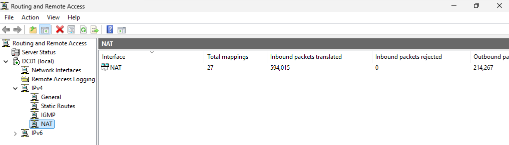
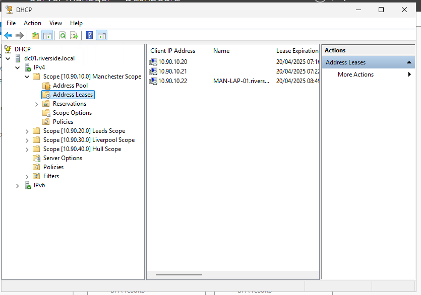
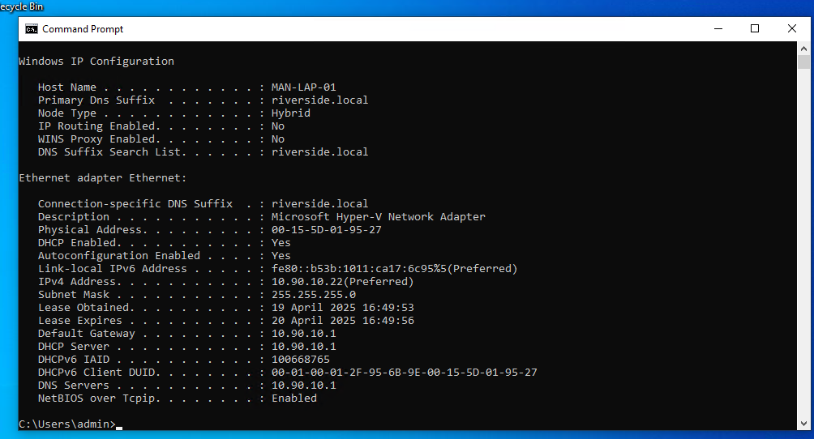

##  `documentation/ip-addressing-scheme.md`

###  Purpose  
This document details the internal IP addressing scheme used across the virtual lab network. Each site (Manchester, Leeds, Liverpool, Hull) is logically segmented into its own subnet to simulate real-world office branch networking. The goal is to mirror common enterprise setups for Active Directory, DHCP, and inter-site routing practices.

---

###  Subnet Overview

| Site         | Network        | Subnet Mask   | IP Range              | Purpose        |
|--------------|----------------|---------------|------------------------|----------------|
| Manchester   | 10.90.10.0     | 255.255.255.0 | 10.90.10.1 – .254      | Head Office    |
| Leeds        | 10.90.20.0     | 255.255.255.0 | 10.90.20.1 – .254      | Branch Office  |
| Liverpool    | 10.90.30.0     | 255.255.255.0 | 10.90.30.1 – .254      | Branch Office  |
| Hull         | 10.90.40.0     | 255.255.255.0 | 10.90.40.1 – .254      | Branch Office  |
| NAT Network  | 192.168.100.0  | 255.255.255.0 | 192.168.100.1 – .254   | Internet NAT   |

---

###  Addressing Conventions

- **.1** reserved for DC01’s interface on that subnet (acting as default gateway + DHCP relay)
- **.2 – .19** reserved for infrastructure (future additions like file servers, printers, etc.)
- **.20 – .250** reserved for dynamic DHCP lease pool
- **.251 – .254** reserved for static/manual assignments if needed (e.g., firewall, test servers)

---

###  Routing Design

- All subnets are routed via DC01
- RRAS service enabled on DC01 for inter-site routing and internet NAT
- NAT is handled via internal adapter connected to `192.168.100.0/24` (NATSwitch)

---

###  DHCP Configuration (via DC01)

| Subnet       | Scope Range             | Default Gateway | DNS Server     | Domain Name       |
|--------------|--------------------------|------------------|----------------|--------------------|
| Manchester   | 10.90.10.20 – .250       | 10.90.10.1       | 10.90.10.1     | riverside.local    |
| Leeds        | 10.90.20.20 – .250       | 10.90.20.1       | 10.90.10.1     | riverside.local    |
| Liverpool    | 10.90.30.20 – .250       | 10.90.30.1       | 10.90.10.1     | riverside.local    |
| Hull         | 10.90.40.20 – .250       | 10.90.40.1       | 10.90.10.1     | riverside.local    |

---

###  Lessons Learned

- Simulating multi-site routing on a single host was harder than expected but rewarding
- Needed to manually configure static IPs on server NICs to match role and subnet layout
- DHCP relay wasn't needed since DC01 has an interface in each subnet

---

###  Client Configuration

This is the configuration handed to a client on the Manchester site subnet (10.90.10.x/24).
