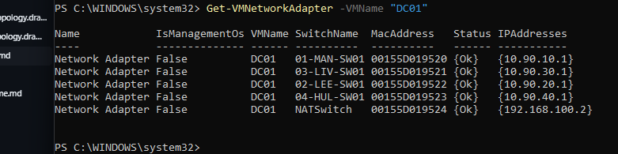
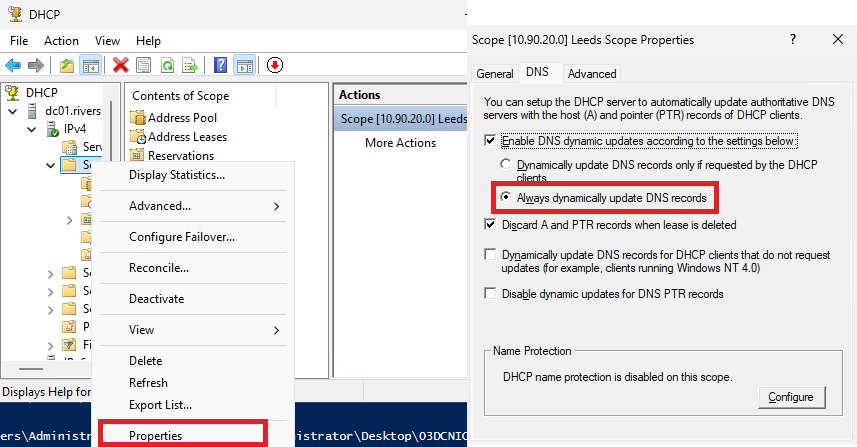

# Build Process (Step-by-Step)

### Step 1a:

- Create one Internal switch: `NATSwitch` and configure static IP of `192.168.100.1/24` on Host 
- > Automate Step 1a: [Create NAT and Config](../build-scripts/01aImportHyperVandCreateNATSwitchandConfigHostNIC_Host.ps1) script.

### Step 1b: Create Virtual Switches

Open Hyper-V Manager > Virtual Switch Manager

- Create four Private switches: `MAN-SW01`, `LEE-SW01`, `LIV-SW01`, `HUL-SW01`
- > Step 1b should be done manually

---

### Step 2a: Create Domain Controller (DC01)

- Name: `DC01`
- Generation: 2
- RAM: 4GB
- Disk: 80GB
- OS: Windows Server 2025 (Evaluation ISO)

In VM Settings:
- Add NATSwitch 
- > Automate Step 2a: [Create DC VM](../build-scripts/02aCreateDCVM_Host.ps1) script.

#### Step 2b:

Manually Add network cards to the private switches to the VM using Hyper V settings - `MAN-SW01`, `LEE-SW01`, `LIV-SW01`, `HUL-SW01`

- Right Click DC01 in Hyper V Manager > Settings
- Add Hardware > Network Adapter > Click Add
- Select each of the private switches from the virtual switch dropdown and click apply
- Add all switches and Click OK
- Start DC01 and install the OS.

> Step 2b needs completing manually on the host machine.
---

### Step 3a: Rename NIC`s to suitable names

On DC01:

- Rename NICs in **Control Panel > Network and Sharing Center > Change Adapter Settings**
- Use `Get-VMNetworkAdapter -VMName "DC01"` (on host) to match NICs to V-switches via the MAC addresses.

\
*Screenshot of powershell output on host machine, showing all NIC`s on DC01.*

\
*This can be matched on te NIC details on DC01 by double-clicking a NIC, then clicking Details and looking for the MAC address.*

> Step 3a Needs completing manually.

#### Step 3b: IP Configuration (Static):

| NIC Role       | IP Address     | Subnet         | Gateway         | DNS              |
|----------------|----------------|----------------|------------------|------------------|
| MAN            | 10.90.10.1     | 255.255.255.0  | (leave blank)   | 10.90.10.1       |
| LEE            | 10.90.20.1     | 255.255.255.0  | (leave blank)   | 10.90.10.1       |
| LIV            | 10.90.30.1     | 255.255.255.0  | (leave blank)   | 10.90.10.1       |
| HUL            | 10.90.40.1     | 255.255.255.0  | (leave blank)   | 10.90.10.1       |
| NATSwitch      | 192.168.100.2  | 255.255.255.0  | 192.168.100.1   | 8.8.8.8 / 1.1.1.1|

> Automate Step 3b on DC01: [Configure DC01 Network Cards](../build-scripts/03bDCNICConfig_DC01.ps1) script.

---

### Step 4a: Add Roles and Promote to Domain Controller

- Change PC name to `DC01` and restart.
- Open **Server Manager > Add Roles and Features**.
- Add:
  - Active Directory Domain Services
  - DHCP Server
  - DNS Server
  - Remote Access
- Install required management tools.

> Automate Step 4a: [Change PC name and Add roles](../build-scripts/04aRenameandAddRoles_DC01.ps1) script.

### Step 4b: Domain Setup

- Create **new forest**: `riverside.local`
- Set a secure **Directory Services Restore Mode (DSRM)** password (not shown).
- Use default NetBIOS name.
- Restart when prompted.

> Automate Step 4b: [Domain Setup](../build-scripts/04bADDSSetup_DC01.ps1) script.

---

### Step 5: Configure DHCP

In Server Manager:

- Complete DHCP post-install configuration.
- Tools > DHCP > [ServerName] > IPv4 > New Scope

Repeat for each site:

| Setting            | Value                  |
|--------------------|------------------------|
| Start IP           | 10.90.x.20             |
| End IP             | 10.90.x.250            |
| Subnet Mask        | 255.255.255.0          |
| Lease Duration     | 1 Day                  |
| Gateway            | 10.90.x.1              |
| DNS Server         | 10.90.10.1             |

- Right-Click each scope > Properties > DNS > Ensure "Always dynamically update DNS records" is selected.

*Ensure all scopes are active and assigned to the correct interfaces.*

> Automate step 5: [DHCP Setup](../build-scripts/05CreateDHCPScopes_DC01.ps1) Script.
---

### Step 6: Configure DNS

- Confirm A records are being created.
- Add Forwarders: `8.8.8.8`, `1.1.1.1`
- Right-click Reverse Lookup Zones > New Zone (per subnet)

Set each to:
- Zone Type: Primary
- Scope: To all servers in the domain
- Zone Name: Based on subnet (e.g. `10.90.10`)
- Dynamic Updates: Secure only

For each DHCP scope:
- Enable dynamic DNS updates
- Enable updates for clients not requesting DNS

---

### Step 7: Setup RRAS (Routing & NAT)

- Tools > Routing and Remote Access
- Right-click `DC01` > Configure and Enable Routing and Remote Access
- Select **Custom Configuration** > NAT and LAN Routing
- Start Service

#### Enable NAT:

- Expand `DC01 > IPv4 > NAT`
- Right-click > New Interface > Select `NATSwitch`
- Choose:
  - Public Interface Connected to Internet
  - Enable NAT on this interface

Restart the server.

---

Then I moved on to the [AD Structure](../active-directory/ou-structure.md)